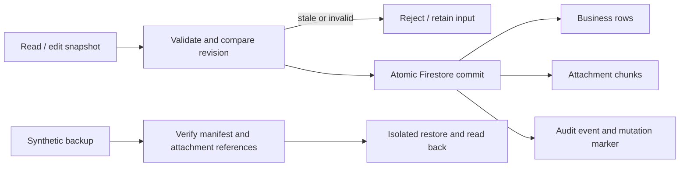

# 覚善：保存制御と隔離復元の設計

## System Overview
CURRENT FACTS: f0cae1c6のfirebase-adapter.jsは20業務collectionを扱う。添付はFirestore _attachment_chunksと旧RTDB blobs/migration-v1。有給・従業員にはrevision比較があるが汎用更新にはない。firestore.rulesは管理者の包括許可。
REQUIREMENTS: 正当な既存入力と管理者運用を保ち、古い編集の拒否、保存時の最小検査、本文を記録しない監査、合成データによる一式復元を実証する。
PROPOSED: 共通アダプターでrevision付き保存と同一commit監査を追加。Rulesは既存管理者境界を保持し、ID・revision・変更された請求型を検査する。復元の実証は隔離環境限定。
Structure investigation: assets/js/firebase-adapter.js readRows/selectRows/updateRow/atomicWrite/insertEmployees; dispatch.js openClientModal/saveClient; billing-settings.js openBillingModal/saveBilling; firestore.rules; tests/firebase-adapter.test.mjs。

| Gate | Decision |
|---|---|
| goal | 失われる更新と、原因を追えない保存を減らす |
| owning layer | FirebaseAdapter、既存編集handler、Firestore Rules、隔離復元utility |
| failure boundary | 競合・不正・監査失敗は業務行と添付をcommitしない |
| existing component | revisionOf、Firestore transaction、writeBlobs、既存49test |
| NOT implement | 本番操作、顧客データ取得、移行、課金・権限変更、誠、公開 |
| acceptance | 古い編集拒否、監査同時保存、欠損復元拒否、正常復元、49回帰 |
| validation / rollback | 合成fixtureとemulator。ローカル候補のみ。適用後rollbackは旧Rulesへ戻す前に監査要件差を評価 |

## Actor
既存ledger_admin利用者。新しい利用者・権限は追加しない。復元演習担当はlocalhost demo環境だけ。

## Scope/Out of Scope
20業務collectionの共通保存層。取引先・請求の編集開始revisionを明示保持する。他画面は共通読取snapshotで保護するが、同じ画面で再読込後も開いた編集が残る経路は追加UI確認対象。本番の一式backup取得と運用保持期間は今回対象外。

## Business Flow
読込→編集開始→保存→revision比較→行・添付・監査の原子commit→一覧再読込。競合は入力を残して拒否、再読込を促す。復元はmanifestと全参照を検査→空の隔離destinationへ復元→再export一致確認。

## ER/Domain Model
業務行: 既存id、既存fieldsに_revisionと_auditIdを追加。legacy revision欠落は0。監査event: UUID、actorUid、recordedAt、created/updated/deletedの文書pathリスト。本文・値・氏名・emailは保存しない。1commit対1event、event対1〜450行。_meta/last-writeは最新event IDのポインタ。旧eventは管理者クライアントでも更新/削除不可。添付構造と既存counterは維持する。

## Screen/Navigation
既存取引先・請求modalと保存/削除操作。新画面・routeなし。失敗toastは理由を示し入力を保つ。取消・一覧遷移は維持。

## Screen/API/Data mapping
| Operation | Handler | Read / write | Boundary / result |
|---|---|---|---|
| 取引先編集 | openClientModal/saveClient | clients id/revision/既存fields | 開始revisionでCAS、失敗時入力保持 |
| 請求編集 | openBillingModal/saveBilling | billing id/revision/既存fields | 整数amount・bool変更検査、CAS |
| 共通CRUD・CSV・契約 | FirebaseAdapter | 20collections、chunks、audit | transaction・450上限、採番維持 |
| 隔離復元 | scripts/security | synthetic Firestore/RTDB snapshot | 内容hash・参照整合、localhostのみ |

## Validation/Invariants
ID変更禁止、revision安全整数かつ+1、legacy revision0対応。Rulesは業務table allowlistと管理者claimsを維持。auditは同一commit作成・immutable、markerとeventの整合、削除も対象リストに含める。共有audit/marker参照でRules access-call予算を保つ。clientは有限数・不正objectとidentityを拒否。既存の未知fieldsや古い未変更の請求値を否定しない。法的料金・丸め・契約内容を追加しない。

## Impact Scope
共通adapterと2編集handler、Rules候補、tests、復元script/document。公開ファイルにsecret追加なし。旧クライアントは新Rulesで監査のない保存が拒否されるため、反映は新client配布→同版確認→Rulesの段階が必要。Rules未反映期間はDB強制を達成しない。

## Contradictions/Unknowns
本番Rulesとデータ内容はUNKNOWN。取得禁止のため本番互換性の保証にはしない。監査保持期間・利用者表示は今回追加しない。独立reviewと全画面実renderは親担当。restore exerciseは合成データのみで本番backupの復元可能性証明ではない。これらは隔離実装を妨げない。

## Implementation Readiness
Implementation Readiness: READY
設計artifact全頁のvisual QA完了後に隔離実装へ進む。独立QAと公開承認は別途必要。
